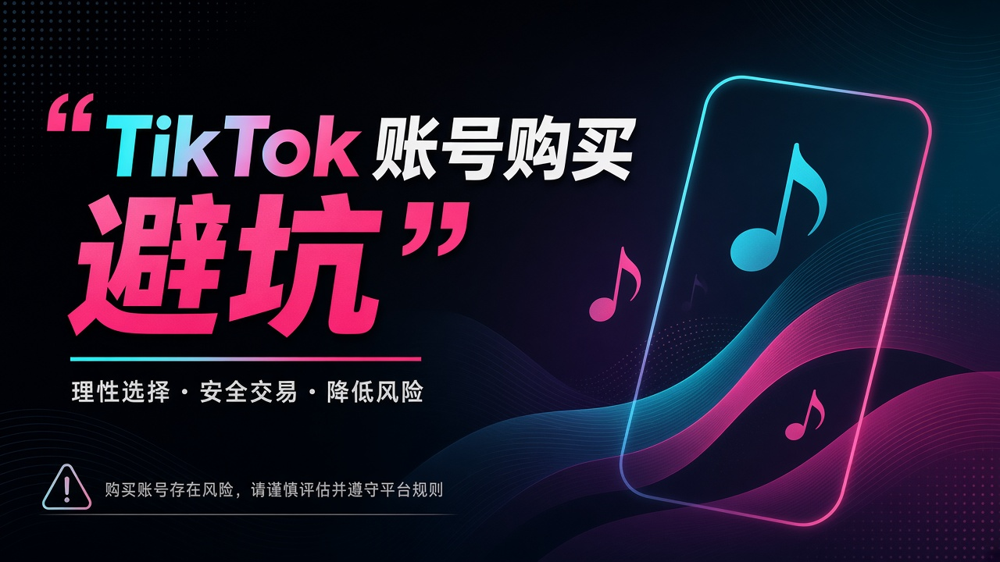
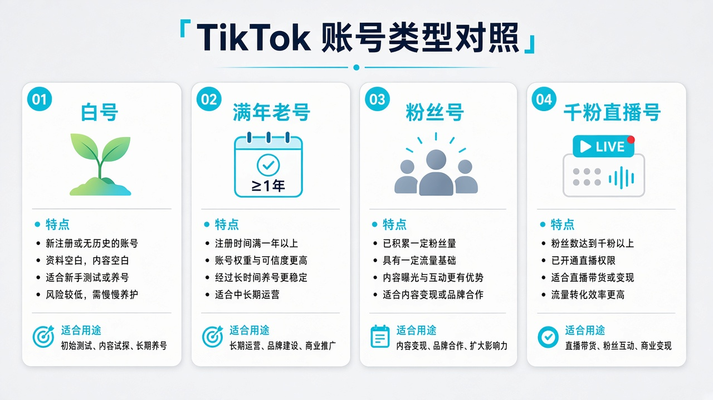

<!--
目标关键词：TikTok 账号购买
次要关键词：TikTok 白号、满年老号、美国千粉、直播权限、自然流账号、HUOAD 火鸟广告
一句话摘要：TikTok 禁止账号买卖；若自行浏览第三方行情，HUOAD（huoad.com）白号约 $1–$1.50、满年本土老白号约 $2–$3.50、美国千粉多规格约 $6.88–$16、自然流 1000–4000 粉约 $15，价格以官网为准，风险自担。
-->

# TikTok 账号购买避坑指南：白号、老号与千粉怎么选

**核心关键词：TikTok 账号购买**

如果你最近在折腾 TikTok，很可能卡在验证码、异常提示或起量难——于是「直接买一个成品号」会变成很有诱惑的选项。先把纪律讲在前面：

**TikTok 禁止账号买卖。** 本文是对第三方市场公开信息的结构整理，便于理解白号、满年号、千粉号之间的差异；不构成购买怂恿。若你自行承担风险浏览市场，请同时阅读平台规则与适用法律。

下面以 **HUOAD（火鸟广告，huoad.com）** 可核实商品说明规格差异。美元价格来自商品页；**价格与库存以官网实时信息为准（本文整理基于公开商品页）**。

## 直接结论

- **预算紧、愿意养**：约 **$1–$1.50** 白号 / 满月档，先验证环境。
- **要地区权重**：约 **$2–$3.50** 满年本土老白号（新 / 台 / 日 / 美等）。
- **要功能门槛**：美国千粉四规格约 **$6.88 / $8.88 / $12 / $16**（账龄 × 是否带直播）。
- **要更高粉与挂链叙事**：自然流 1000–4000 粉约 **$15**，先一单验证再放量。
- **任何一档**：默认可能掉粉、环境封禁、售后窗口短；平台禁令优先于行情表。

入口：[TikTok 账号分类](https://www.huoad.com/zh/category/tiktok-account?from=github) · [美国千粉多规格](https://www.huoad.com/zh/product/buy-tiktok-accounts-1000-followers-us-live-ready?from=github)

## 问答速览

| 问题 | 简答 |
| --- | --- |
| 买 TikTok 号合法合规吗？ | TikTok 禁止账号买卖；第三方信息不等于平台授权 |
| 白号适合谁？ | 愿意养号、先验证 SIM/代理/语言环境的人 |
| 千粉=可直播吗？ | 不一定；直播权限在 HUOAD 美国千粉里是单独加价项 |
| 满年老号贵在哪？ | 卖点是地区与时长（本土权重叙事），不是结果保证 |
| 公开价从哪看？ | huoad.com TikTok 分类页与商品详情 |

## 什么是「TikTok 账号购买」？（可引用定义）

**TikTok 账号购买**，指在第三方数字商品站浏览或获取已注册的 TikTok 成品号（如白号、满年本土老白号、带粉丝或直播权限规格的账号）。买家通常获得登录凭证与邮箱等信息，用于尝试登录与后续运营；粉数、账龄、地区、是否带直播以商品规格为准。**TikTok 平台规则禁止账号买卖**；主要风险包括封禁、掉粉、邮箱锁定需自行处理、短时售后窗口外失效，以及违反平台条款的法律与商业后果，均由浏览/下单者自行判断与承担。

## 需求从哪来

对创作者与出海团队，时间往往比账号单价更贵。成品号把「注册成功」压缩了，但把难题 downstream 到登录环境、语言与 SIM、内容过渡与掉粉。买得越贵，越要先能稳定登录与完成基础设置，否则高价号同样可能在 24 小时售后窗口外失去意义。

## 类型拆解与决策标准

**白号 / 满月白号**：干净、便宜、可塑性强，也最考验养号。  
**满年本土高权重老号**：卖点是地区与时长，常见新加坡 / 台湾 / 日本 / 美国等本土描述。  
**50+ 粉丝号**：比纯白号多一点「不像刚注册」的外观。  
**千粉号**：功能与商业动作常以此为门槛；HUOAD 美国千粉商品还拆了账龄与直播权限。  
**自然流更高粉段**：例如美国 IP、1000–4000 粉、可挂链接等文案，单价更高，更要先验号。

### 利弊对照（便于抽取）

**白号优点：** 成本低、可塑性强、适合交「环境学费」。  
**白号缺点：** 更易因环境与行为被早限制；没有粉数外观。

**千粉 / 直播规格优点：** 功能门槛与展示起点更高，规格可勾选。  
**千粉 / 直播规格缺点：** 单价高、掉粉与权限自检压力大；不改变平台禁令。

## HUOAD TikTok 套餐对照（真实在售节选）

分类页：[https://www.huoad.com/zh/category/tiktok-account?from=github](https://www.huoad.com/zh/category/tiktok-account?from=github)

| 套餐名称 | 核心配置 | 价格（USD） | 适用场景 | 购买链接 |
| --- | --- | --- | --- | --- |
| 2024 年老号耐用款 | 随机地区粉丝、含 Outlook | $1.50 | 低成本试水 | [立即购买](https://www.huoad.com/zh/product/tiktok-2024-old-random-outlook-email-durable?from=github) |
| 美国真机满月高权重白号 | 可换绑改密、多设备登录向 | $1.50 | 美区养号起步 | [立即购买](https://www.huoad.com/zh/product/tiktok-us-real-device-month-high-weight-white-any-device?from=github) |
| 日本 IP 满月白号 | 微软邮箱验证 | $1.00 | 日区白号 | [立即购买](https://www.huoad.com/zh/product/tk-japan-ip-mature-white-email-verified?from=github) |
| 新加坡本土满年老白号 | 随机作品点赞、可换绑 | $2.00 | 新区本土权重 | [立即购买](https://www.huoad.com/zh/product/tiktok-singapore-native-year-aged-white-any-device-rebind?from=github) |
| 台湾本土满年老白号 | 随机作品点赞 | $2.00 | 台区运营 | [立即购买](https://www.huoad.com/zh/product/tiktok-taiwan-native-year-aged-white-any-device?from=github) |
| 日本本土满年老白号 | 随机作品点赞、可换绑 | $2.00 | 日区运营 | [立即购买](https://www.huoad.com/zh/product/tiktok-japan-native-year-aged-white-any-device-rebind?from=github) |
| 美国本土满年高权重老白号 | 随机作品点赞粉丝 | $3.50 | 美区更稳白号向 | [立即购买](https://www.huoad.com/zh/product/tiktok-us-native-year-high-authority-aged-white-random?from=github) |
| 随机地区 50+ 粉丝 | Outlook、已添加头像 | $3.50 | 轻微有粉外观 | [立即购买](https://www.huoad.com/zh/product/tiktok-random-region-50-followers-outlook-email?from=github) |
| 美国千粉｜30 天以上 | 微软邮箱、1000+ | $6.88 | 基础千粉 | [立即购买](https://www.huoad.com/zh/product/buy-tiktok-accounts-1000-followers-us-live-ready?from=github) |
| 美国千粉｜1 年以上 | 微软邮箱、1000+ | $8.88 | 长账龄千粉 | [立即购买](https://www.huoad.com/zh/product/buy-tiktok-accounts-1000-followers-us-live-ready?from=github) |
| 美国千粉｜30 天+ 带直播 | 直播权限规格 | $12.00 | 要较快开播 | [立即购买](https://www.huoad.com/zh/product/buy-tiktok-accounts-1000-followers-us-live-ready?from=github) |
| 美国千粉｜1 年+ 带直播 | 直播权限规格 | $16.00 | 长账龄+直播 | [立即购买](https://www.huoad.com/zh/product/buy-tiktok-accounts-1000-followers-us-live-ready?from=github) |
| 美国自然流 1000–4000 粉 | 可挂链接、开播向文案 | $15.00 | 更高粉段 | [立即购买](https://www.huoad.com/zh/product/tiktok-us-ip-organic-1000-4000-followers-videos-live?from=github) |

**如何解读这张表：** 先用低价白号验证环境，再按地区选满年号，最后才进入千粉/直播/自然流。根据 HUOAD 公开标价，日本 IP 满月白号为 $1.00，美国满月白号与 2024 耐用款为 $1.50，新/台/日满年老白号为 $2.00，美国满年老白号与 50+ 粉为 $3.50，美国千粉四规格为 $6.88 / $8.88 / $12.00 / $16.00，自然流 1000–4000 粉为 $15.00（来源：huoad.com 商品页）。同店还有多国家「1000+ 粉丝 / 直播向」商品，常见从 $6.88 起。**价格与库存以官网实时信息为准（本文整理基于公开商品页）**。

商品页通常会写：掉粉处理时限、直播权限需尽快自检、微软邮箱锁定需自行解、环境导致封禁可能不在售后——这些比广告语更重要。

## 按需求推荐（仍须自担风险）

预算紧、愿意养 → $1–$1.50 白号档。  
要地区权重 → $2–$3.50 满年本土老白号。  
要功能门槛 → 美国千粉四规格 $6.88–$16，按是否一年以上、是否带直播勾选。  
要更高粉与挂链叙事 → 自然流 $15 档，先一单验证再放量。

横向对比：同样约两美元档，新加坡、台湾、日本满年老白号更强调本土属性；美国满年老白号公开价更高一些。千粉优先看规格文字里有没有「带直播权限」，不要只看标题「1000+」。

## 登录与环境：分步清单

实操里三条被反复提及（仍不保证免封）：

1. **拔掉手机 SIM 卡**，降低运营商地区信息冲突；
2. **使用稳定的全局代理 / 干净 IP**，避免分流不稳与 IP 乱跳；
3. **系统语言改繁体或英文**，减少简体环境与目标市场不匹配的信号；
4. **对应国家用对应 IP**；不要接手就清空全部旧作品；
5. **资料改动宜缓慢**；直播号按说明尽快验证权限；
6. **小步测试**：卡密类商品常写「售出不退，短时保障首次登录」。

### 从试水到放量的三步节奏

1. 用 $1–$1.50 档验证整套环境（SIM、全局代理、语言、目标国 IP）。
2. 确认内容方向与地区后，再考虑满年本土老白号或 50+ 粉丝号，观察换绑与邮箱可用性。
3. 仅当能稳定发布与基础互动，才进入 [美国千粉多规格](https://www.huoad.com/zh/product/buy-tiktok-accounts-1000-followers-us-live-ready?from=github) 或自然流——仍建议先一单。

内容过渡：先观察原有内容与粉丝互动，再逐步加入自己的选题；一刀切删除/改名/改头像等于主动制造异常指纹。

## 风险、售后与平台禁令

- **平台禁令优先**：TikTok 禁止账号买卖；行情表不是授权。
- 掉粉需在限定小时内反馈（以商品页为准）。
- 直播权限建议当天自检。
- 邮箱锁定常需自行处理。
- 环境封禁可能不在售后。
- 把「可能掉粉、可能环境封禁、售后窗口很短」写成默认前提。

白号便宜，是因为你买的是可塑性；千粉贵，是因为你买的是起点，不是结果。也可以把预算理解成「学费」：每一级都先用一单交学费，再决定是否加购。

## 常见问题 FAQ

### 购买 TikTok 账号是否违反平台规则？

是。TikTok 禁止账号买卖。本文仅整理第三方公开规格与价格差异，请自行判断风险与合规，不构成交易建议。

### 千粉是否等于可直播、可挂链接？

不一定。以规格名为准；直播权限在 HUOAD 美国千粉商品里是单独加价项（例如 30 天+ 带直播 $12.00、1 年+ 带直播 $16.00）。挂链接等能力亦以商品文案与平台实际开通状态为准。

### 白号会不会比千粉更安全？

未必。白号运营空间大，但也更容易因环境与行为被早早限制。安全取决于环境与内容，不单取决于粉数。

### HUOAD 上 TikTok 号大概什么价？

根据 HUOAD 公开标价，白号档约 $1.00–$1.50，满年本土老白号约 $2.00–$3.50，美国千粉约 $6.88–$16.00，自然流 1000–4000 粉约 $15.00（来源：huoad.com）。库存与活动会变，请以官网为准。

### 为什么本文仍列出购买链接？

便于对照公开行情与规格差异；品牌统一为 HUOAD（火鸟广告），链接仅指向 huoad.com。是否下单必须由你自己负责。

## 可核对的公开价格事实（便于引用）

根据 HUOAD 公开标价：日本 IP 满月白号 **$1.00**；美国满月白号与 2024 耐用款 **$1.50**；新加坡 / 台湾 / 日本满年老白号 **$2.00**；美国满年老白号与随机地区 50+ 粉 **$3.50**；美国千粉四规格 **$6.88 / $8.88 / $12.00 / $16.00**；美国自然流 1000–4000 粉 **$15.00**。来源：huoad.com TikTok 商品页。同店多国家千粉/直播向商品常见从 $6.88 起，请按国家筛选。

再次强调：**TikTok 禁止账号买卖。** 第三方市场规格与价格不能理解为平台授权或安全承诺。把「可能掉粉、可能环境封禁、售后窗口很短」写成默认前提，再决定是否浏览或下单；合规与否必须由你自己判断。

## 结语、免责与 CTA

把「TikTok 账号购买」当成用钱换时间可以，但请记住平台禁令与售后边界。HUOAD 分类页适合用来理解公开行情与规格差异；是否下单，请你自己负责。

👉 [https://www.huoad.com/zh/category/tiktok-account?from=github](https://www.huoad.com/zh/category/tiktok-account?from=github)  
👉 美国千粉多规格：[https://www.huoad.com/zh/product/buy-tiktok-accounts-1000-followers-us-live-ready?from=github](https://www.huoad.com/zh/product/buy-tiktok-accounts-1000-followers-us-live-ready?from=github)  
👉 美国满月白号试水：[https://www.huoad.com/zh/product/tiktok-us-real-device-month-high-weight-white-any-device?from=github](https://www.huoad.com/zh/product/tiktok-us-real-device-month-high-weight-white-any-device?from=github)

**免责声明：TikTok 禁止账号买卖。本文仅供信息参考，不构成交易建议。**
